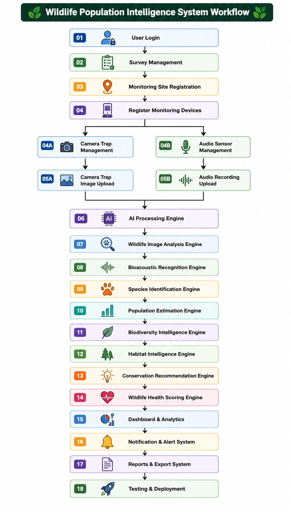

# Day 1 — Project Initialization, Requirement Analysis, SDLC, User Stories & Workflow Analysis
## Wildlife Population Intelligence System

---

## 1. Project Initialization

**Project Title:** Wildlife Population Intelligence System

**Objective:**
Build an AI-powered platform that uses image recognition, acoustic analysis, computer vision, and machine learning to automatically identify wildlife species, estimate population sizes, monitor biodiversity changes, detect endangered species, and analyze habitat health.

**Data Sources:**
- Camera trap images
- Drone imagery
- Satellite data
- Environmental sensors
- Wildlife audio recordings

**Target Users:**
| Role | Purpose |
|---|---|
| Wildlife Researcher | Uploads survey data, views species observations, population analytics, biodiversity reports |
| Conservation Officer | Monitors threats, conservation priorities, species trends, restoration recommendations |
| Forest Department Officer | Monitors protected areas, wildlife movement, patrol planning, incident reports |
| Administrator | Manages users, platform analytics, monitoring system configuration, report generation |

**Project Scope (Phase 1):**
- User authentication & role-based access
- Wildlife survey & monitoring management
- Image-based species detection
- Audio-based species detection (bioacoustics)
- Population estimation & biodiversity analytics
- Habitat intelligence & conservation recommendations
- Dashboards, alerts, and reports

---

## 2. Requirement Analysis

### 2.1 Functional Requirements (What the system does)

| ID | Requirement |
|---|---|
| FR-01 | User registration, login, and role-based access control |
| FR-02 | Create and manage wildlife surveys and monitoring sites |
| FR-03 | Register camera traps and audio sensors with GPS location |
| FR-04 | Upload camera trap / drone images for analysis |
| FR-05 | Detect animals in images and classify species (with confidence score) |
| FR-06 | Upload wildlife audio recordings for bioacoustic analysis |
| FR-07 | Detect and classify animal calls (bird, mammal, amphibian, insect) |
| FR-08 | Estimate population size, density, and growth trends per species |
| FR-09 | Calculate biodiversity index and species richness |
| FR-10 | Assess habitat quality and detect habitat degradation |
| FR-11 | Generate conservation priority recommendations |
| FR-12 | Calculate overall ecosystem health score (weighted model) |
| FR-13 | Send alerts (endangered species detected, population decline, habitat degradation, sensor issues) |
| FR-14 | Generate and export reports (PDF/Excel) |
| FR-15 | Role-specific dashboards (Researcher, Conservation Officer, Forest Dept, Admin) |

### 2.2 Non-Functional Requirements (How the system performs)

| ID | Requirement |
|---|---|
| NFR-01 | **Performance** — low image inference and audio processing latency |
| NFR-02 | **Scalability** — support multiple concurrent monitoring sites/users |
| NFR-03 | **Security** — JWT authentication, OAuth2, encrypted data storage |
| NFR-04 | **Reliability** — stable uptime for continuous monitoring |
| NFR-05 | **Usability** — simple dashboards for non-technical field staff |
| NFR-06 | **Maintainability** — modular microservices architecture |
| NFR-07 | **Portability** — Dockerized, deployable on AWS/Azure |
| NFR-08 | **Accuracy** — high species classification and detection accuracy |

---

## 3. SDLC — Agile Model

This project will be built using the **Agile (Incremental/Iterative) SDLC model**, since requirements will evolve across milestones and each 2-week sprint is planned to deliver a working, testable increment.

**Why Agile fits this project:**
- Features (image AI, audio AI, population engine, dashboards) can be built and tested independently, sprint by sprint
- Feedback from each milestone shapes the next
- Reduces risk — working software delivered every 2 weeks instead of one big release at the end

**Agile Flow followed in this project:**

```
Sprint Planning → Design → Development → Testing → Review/Demo → Review & Improve → Next Sprint
```

**Mapped to project milestones:**

| Sprint (Milestone) | Duration | Focus |
|---|---|---|
| Milestone 1 | Week 1–2 | Project init, architecture, auth, core setup |
| Milestone 2 | Week 3–4 | Species recognition & biodiversity analysis |
| Milestone 3 | Week 5–6 | Population intelligence & conservation engine |
| Milestone 4 | Week 7–8 | Analytics, testing, deployment |

Each sprint has: **Tasks → Development → Testing → Outcome/Deliverable**, matching the Agile principle of shipping working increments.

---

## 4. User Stories

**Wildlife Researcher**
- As a Wildlife Researcher, I want to register a new monitoring site with GPS coordinates, so that I can track survey locations accurately.
- As a Wildlife Researcher, I want to upload camera trap images, so that species are automatically detected and classified.
- As a Wildlife Researcher, I want to upload audio recordings, so that animal calls are identified without manual review.
- As a Wildlife Researcher, I want to view population analytics for a species, so that I can study trends over time.

**Conservation Officer**
- As a Conservation Officer, I want to receive alerts when an endangered species is detected, so that I can respond quickly.
- As a Conservation Officer, I want to see population decline alerts, so that I can prioritize conservation action.
- As a Conservation Officer, I want habitat restoration suggestions, so that I can plan restoration activities effectively.

**Forest Department Officer**
- As a Forest Department Officer, I want to monitor protected areas on a map, so that I can track wildlife movement.
- As a Forest Department Officer, I want to view incident reports, so that I can plan patrols in high-risk zones.

**Administrator**
- As an Administrator, I want to manage user roles and permissions, so that access stays secure and controlled.
- As an Administrator, I want to view platform-wide analytics, so that I can monitor overall system usage and health.
- As an Administrator, I want to generate consolidated reports, so that they can be shared with stakeholders.

---

## 5. Wildlife Monitoring Workflow Analysis

End-to-end workflow that the system supports (core flow, implemented incrementally across sprints):



